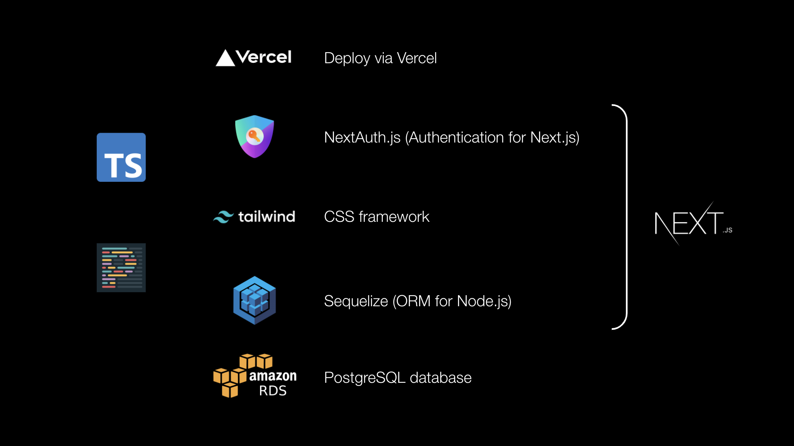
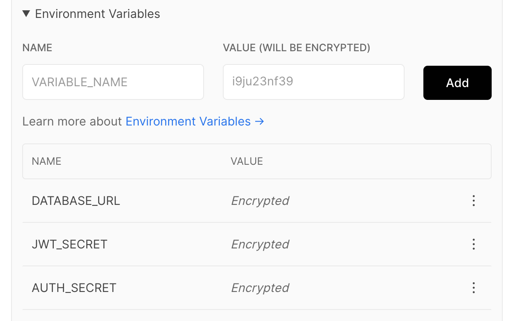

<div align="center">
  <h1>🚲 next-fullstack</h1>
  <p>
    <strong>A lightweight boilerplate for developing full-stack applications with <a href="https://nextjs.org/">Next.js</a></strong>
  </p>
</div>
<br />

**[Check out the demo 📎](https://next-fullstack-demo.vercel.app/)**

This full-stack boilerplates comes with [Sequelize](https://sequelize.org/master/) (a Node.js ORM), [Tailwind CSS](https://tailwindcss.com/) (utility-first CSS framework), and basic authentication with [NextAuth.js](https://next-auth.js.org/). Minimal setup is needed to deploy a basic CRUD application.



The entire boilerplate is written in [Typescript](https://www.typescriptlang.org/) and is set up with pre-commit hooks that compiles Typescript and runs [prettier](https://prettier.io/) (code formatter).

<br />

## From cloning to deploying, a step by step guide

Follow along to get your own version of this boilerplate deployed on Vercel.

<br />

#### Fork and clone repository

[Fork the repository](https://guides.github.com/activities/forking/) into your own account then clone the fork to your local development environment.

```
git clone git@github.com:[USERNAME]/next-fullstack.git
```

<br />

#### Install dependencies

```
yarn install
```

<br />

#### Set up local environment variable

The environment variables required by this boilerplate can be seen in `.env.example`. Create a local environment variable file:

```
cp .env.example .env.local
```

We'll be setting up a database and also OAuth providers in upcoming steps to get values for these variables.

<br />

#### Create a Postgres database

You can create a Postgres database with any service provider. Make sure it is publicly accessible and is password authenticated.

👉 [See example settings for creating an AWS RDS Postgres database.](docs/aws-rds-example.png)

After creation, compose the database URL and update your local environment variable file (`.env.local`)

```
DATABASE_URL=postgres://[USERNAME]:[PASSWORD]@[HOST]:[PORT]/postgres
```

<br />

#### Run migrations

Create tables `users` and `posts`.

```
yarn sequelize-cli db:migrate
```

These are example models and tables. Feel free to roll back (`yarn sequelize-cli db:migrate:undo`) and write your own migrations after you have the basic boilerplate up and running.

<br />

#### Set up OAuth providers

The boilerplate comes set up with Github and Google as OAuth providers, however you are free to [remove or add your own](https://next-auth.js.org/providers/github) by editing the provider entries in the [`[next-auth].ts` file](https://github.com/belay-labs/next-fullstack/blob/master/pages/api/auth/%5B...nextauth%5D.ts#L11) and adding the relevant environment variables.

👉 [Setting up Google OAuth](https://support.google.com/cloud/answer/6158849?hl=en)\
👉 [Setting up Github OAuth](https://docs.github.com/en/free-pro-team@latest/developers/apps/creating-an-oauth-app)

Update environment variables with your OAuth client ID and secret. e.g. for Github:

```
GITHUB_CLIENT_ID=[GITHUB_CLIENT_ID]
GITHUB_CLIENT_SECRET=[GITHUB_CLIENT_SECRET]
```

<br />

#### Run locally

```
yarn dev
```

🚀 Go to [localhost:3000](http://localhost:3000/)!

<br />

#### Run local Postgres Database (with Docker Support)

To start a local database service using Postgres docker image, create a container using the attached `docker-compose.yml`

```sh
docker-compose up -d
```

To termiate local database service, you can take down running container as such

```sh
docker-compose down
```

#### Deploy to Vercel

Applications developed from this boilerplate can be hosted anywhere. These instructions are for deploying via Vercel.

1. [Import](https://vercel.com/import) your project from Github
2. Set your environment variables - you won't know what `API_URL` and `NEXTAUTH_URL` will be until after your first deploy. Vercel will issue your project a unique domain.



3. After deployment grab the domain and update the `API_URL` and `NEXTAUTH_URL` environment variables.
4. Redeploy for new variable to take effect (you can trigger this by pushing to master).

<br />

## Contributing

**[🐛 Submit a bug](https://github.com/belay-labs/next-fullstack/issues/new?labels=bug&template=bug_report.md)** | **[🐥 Submit a feature request](https://github.com/belay-labs/next-fullstack/issues/new?labels=feature-request&template=feature_request.md)**

#### Review & deployment

Create a PR describing the change you've made and someone will be along to review it and get it merged to master. After changes are merged to `master`, we'll trigger a production deployment to https://next-fullstack-demo.vercel.app/.

<br />

## Maintainers

Hi! We're [Cathy](https://github.com/cathykc), [Stedman](https://github.com/stedmanblake), and [Zain](https://github.com/tarzain). Feel free email us at cathy@belaylabs.com! 👋

<br />

## License

[](https://opensource.org/licenses/Apache-2.0)

This project is licensed under the terms of the [Apache-2.0](LICENSE).
